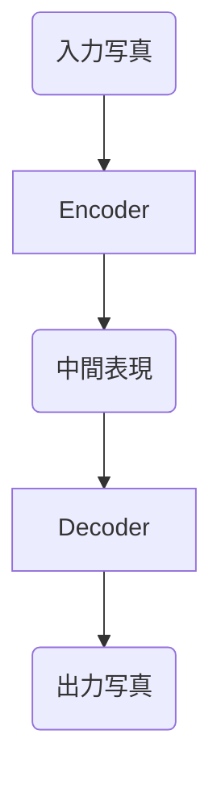
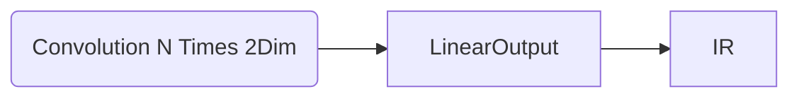
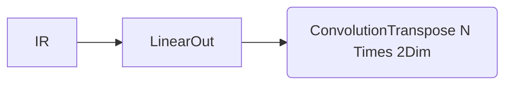
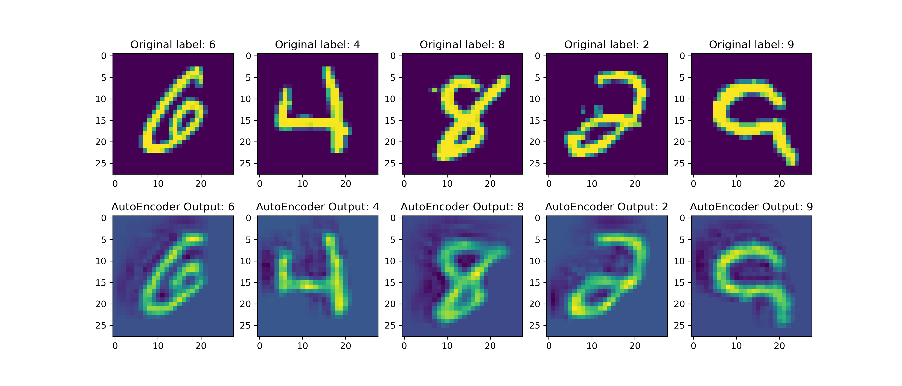

# Final Project: ディープラーニングを用いた画像圧縮

MnistFashionデータセットを対象にしたAutoEncoderアーキテクチャを基づいた画像圧縮ツールのプロトタイプ．

現代のソーシャルメディアには、音、映像、画像は欠かせない要素です。

信号処理ベースの画像圧縮アルゴリズムは比較的成熟しており、ディープラーニング技術の発展に伴い、ニューラルネットワークベースの画像圧縮アルゴリズムが徐々に研究されています。

本プログラムは、Auto Encoderアーキテクチャを用いた画像圧縮・還元ツールです。 データセットのコレクションは限られているため、デモではMnist Fashionデータセットのみを使用しています。

#### 仕上げ

##### 原理及びアキーテクチャ

ここでは、Auto Encoderは以下のようなアーキテクチャの畳み込みニューラルネットワークを用いて実装される。



例えば、サーバーにEncodeを置き、サーバーはEncodeで画像圧縮、受信機はDecoderで縮小、転送時はIRのみを転送する場合。

もちろん、Auto Encoderは、実際には、安定したサーバー・ユーザー間の情報圧縮、転送としては使えないかもしれないが、そのアーキテクチャの特異性から、画像から特徴を抽出し、下流のアプリケーションに渡すために使うことができる。

例えば、Aiを使った画像から画像への変換では、写真をマンガに変換する過程で写真から特徴量を抽出する必要がありますが、これを手作業で行うのは非常に面倒です。AutoEncoderを使えば、End
to Endの画像から画像への変換を完了させることができます。


原画を特徴量とラベルとして用い、Decoderの出力と原画データとのMSEを損失関数とし、この損失関数を最適化してマッチングEncode、Dencoderを学習する．

実際，このプログラムにもこの流れが使われている処理である。

しかし、Mnist Fashionのデータセットだけではつまらないので、このプログラムでは、入力画像を1チャンネルのグレースケール画像として保持するように設計されています。

本プログラムに付属する標準トレーニングスクリプトのデータセットと、データセット内の画像の長さと幅を変更することで、カスタマイズされたオートエンコーダをトレーニングすることが可能です。

##### 実装説明

Encoder、Decoderともに、ディープラーニングのアーキテクチャを採用しており、複数層の畳み込みニューラルネットワークを用いてサンプルの特徴を感知し、出力層として完全に結合した層を使用します。 そのため、多層畳み込みネットワークと多層デコンボリューショナルネットワークをどのように構築するかが、このプロジェクトの難しさの一つです。

このプロジェクトでは、[MuxKit-Learn](https://github.com/LinhMuks-DFox/MuxKit-Learn)をSubフレームワークとして使用し、Pytorchをコアとしてを用いて、Encoder, Decoderを構築しています。

Encoder:



Decoder:


損失関数として元データとDecoderの出力のMSEを用い、Decoderが元データをできるだけ復元できるようにし、Encoderのデータ特徴抽出能力を訓練する方法である。

訓練フェーズ，テストフェーズ，バリデーションフェーズではMuxKit-Learnに実装した`AlchemyFurnace`というクラスを用います．

実際に特長抽出して，特長を用いて画像を元に戻した結果の例：



* 上の図は，元のデータである．
* 下の図は，AutoEncoderの出力である．
* 図によって，AutoEncoderの出力と入力が大体同じであったことが分かります．Encoderは特長抽出したと判断できたでしょう．

注：

* MuxKit-Learn(aka `mklearn`)について
    * MuxKit-Learnは自作したラブライブであり，scikit-learnのように便利な深層学習フレームワークである．
    * 今は開発途中であって，BugFixのフェーズである．1.0のリリースもしていません．
    * この作品に使った部分はUnitテスト済みです
    * 今回はシステム開発の作品の一部分として使います，ここも評価必要な部分だと考えられます．
* デモンストレーションのデータセットについて
    * 開発環境のGPU性能を考え，MNISTを用います．
    * すべてのデータに対応可能だと考えられます．
    * デモンストレーションのデータを使って訓練したもでるは，ホルダーにあります．

#### 使い方

##### 単に動かしてみる場合：

1. 必要なラブライブをインストール：

   ```bash
   pip3 install torch torchvision torchaudio --extra-index-url https://download.pytorch.org/whl/cu116
   
   pip3 install matplotlib
   pip3 install numpy
   pip3 install tqdm
   ```
   Cudaを利用したい場合はcudatoolkitもインストール

   **MuxKit-Learnはすでにプロジェクトホルダーに置いてありますので，インストール必要ありません．**

2. Demo訓練スクリプトを実行する

    ```bash
    python demo.py
    ```

3. 訓練したモデルは日付のある.phtバイナリファイルです
4. プロット関数も用意したので，Encode，Decodeしたものをチェックする場合はそれを用いてください．

##### カスタマイズAutoEncoderをつくる場合：

0. 前と同じく，必要なラブライブをインストール
1. 自分でDatasetクラスをつくる
2. 自作したDatasetクラスに対応するDataloaderをつくる
4. 訓練スクリプトのDataset，Dataloaderを自作した物に変換
5. 訓練スクリプトを実行．